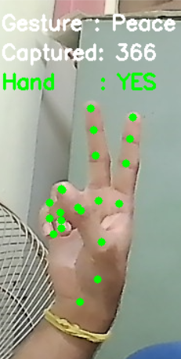
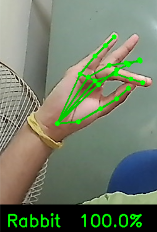
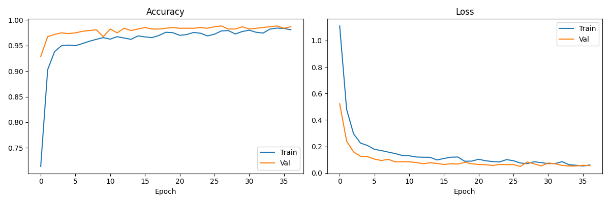
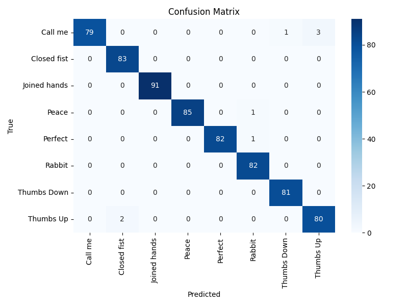

# Hand Gesture Recognition with MediaPipe & PyTorch

A real-time hand gesture recognition system built with MediaPipe's Hand Landmarker (Tasks API) and a PyTorch MLP classifier. Trained on 8 gesture classes with **98.8% validation accuracy**.

<p align="center">
  
</p>

## Gestures

| Gesture | Hands |
|---|---|
| Call Me | 1 |
| Closed Fist | 1 |
| Joined Hands | 2 |
| Peace | 1 |
| Perfect / OK | 1 |
| Rabbit | 1 |
| Thumbs Down | 1 |
| Thumbs Up | 1 |

## How it works

MediaPipe detects up to 2 hands and returns 21 landmarks per hand (x, y, z coordinates), normalized relative to the wrist and scale-normalized. These are packed into a 126-value vector (2 hands × 21 landmarks × xyz, zero-padded if only one hand is present) and fed into a lightweight MLP that classifies the gesture in real time.

```
Webcam → MediaPipe HandLandmarker → 126 landmark values → GestureNet → Predicted gesture
```

The pipeline is fully config-driven — adding a new gesture only requires updating the `GESTURES` list in `collect_gestures.py`. Both `train_model.py` and `inference.py` derive the number of classes dynamically, so no other code changes are needed.

## Project Structure

```
├── collect_gestures.py   # Collect training data from webcam
├── train_model.py        # Train the PyTorch classifier
├── inference.py          # Live real-time gesture recognition
├── gesture_data.csv      # Collected landmark data + labels
├── requirements.txt      # Python dependencies
├── assets/               # Images/GIF used in this README
└── README.md
```

## Setup

**Install dependencies**
```bash
pip install -r requirements.txt
```

> The MediaPipe `hand_landmarker.task` model file (~30MB) is downloaded automatically on first run.

## Usage

### 1. Collect gesture data
```bash
python collect_gestures.py
```
- Press `0–7` to select a gesture class
- Hold the gesture in front of your webcam — samples are captured automatically every 5 frames
- HUD shows the active gesture, capture count, and whether a hand is currently detected
- Press `Q` to quit
- Data is saved to `gesture_data.csv`

<p align="center">
  
</p>

### 2. Train the model
```bash
python train_model.py
```
- Trains a 3-layer MLP on the collected landmark data
- Saves the best model to `gesture_model.pth` and labels to `label_classes.npy`
- Outputs `confusion_matrix.png` and `training_curves.png`

### 3. Run live inference
```bash
python inference.py
```
- Opens your webcam and predicts gestures in real time with a confidence HUD
- Green text = high confidence (≥80%), orange = low confidence, red = no hand detected
- Press `Q` to quit

<p align="center">
  
</p>

## Model

| Property | Value |
|---|---|
| Architecture | MLP (126 → 128 → 64 → 8) |
| Parameters | ~26,000 |
| Input | 126 normalized hand landmark values |
| Output | 8 gesture classes |
| Val accuracy | 98.8% |

### Training curves



Train and validation accuracy converge smoothly to ~98%, with loss dropping steadily and no sign of overfitting.

### Confusion matrix



Near-perfect classification across all 8 classes, with only a handful of mix-ups between visually similar gestures (e.g. "Call Me" vs. "Thumbs Up," which both involve a single extended digit with the rest of the hand curled).

## Requirements

- Python 3.8+
- Webcam
- mediapipe >= 0.10
- torch
- opencv-python
